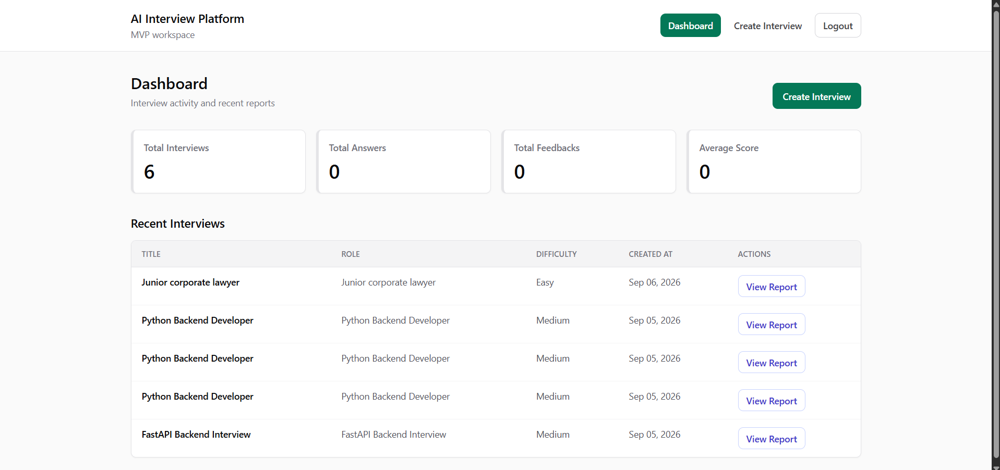
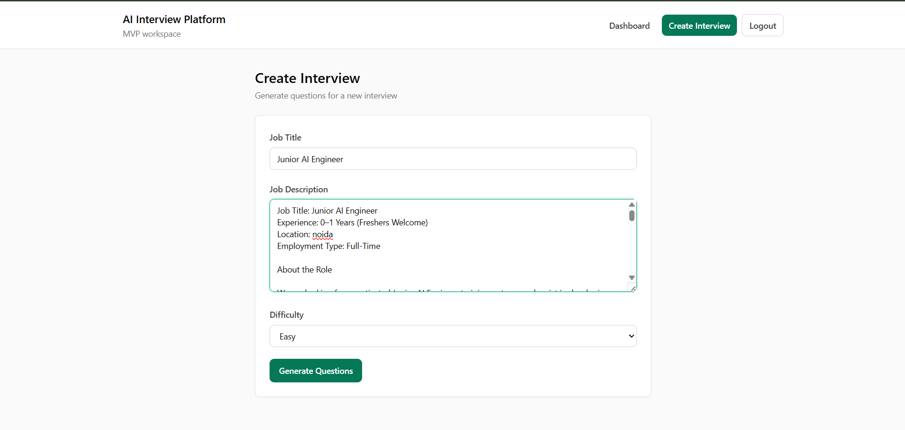
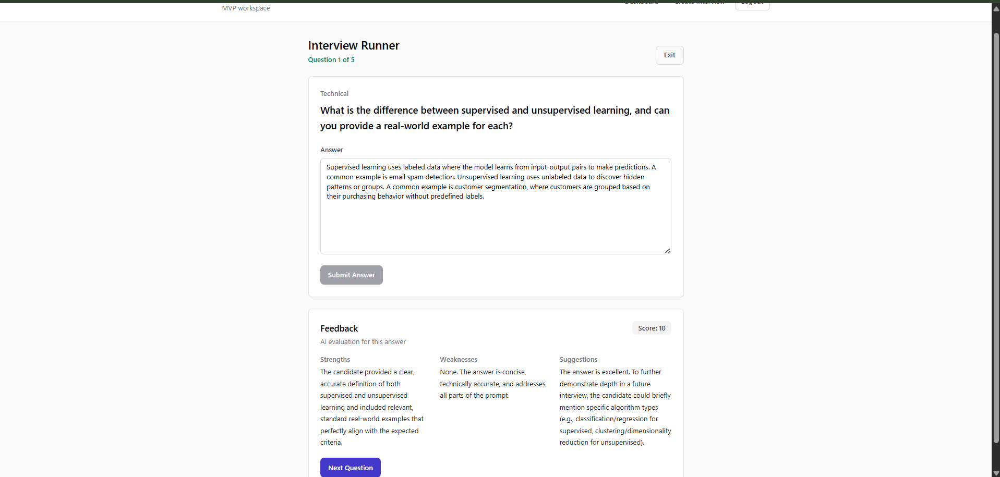
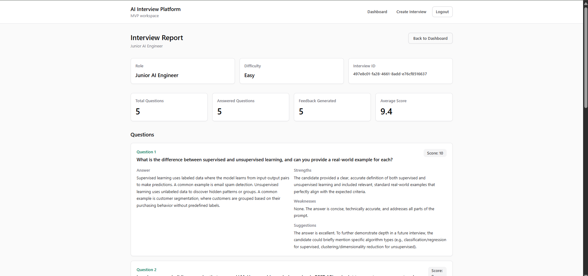
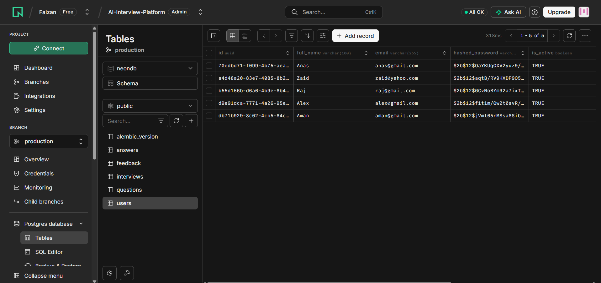

# 🚀 AI Interview Platform

An AI-powered interview preparation platform that automatically generates interview questions from a Job Description using Google Gemini AI.

Built with **React + Vite**, **FastAPI**, **PostgreSQL (Neon)**, and **Google Gemini API**.

---

# 🌐 Live Demo

Frontend (Vercel)

https://ai-interview-platform-git-main-faizans-projects-b9246ece.vercel.app/

Backend (Render)

https://ai-interview-platform-backend-c9qw.onrender.com/docs

---

# 📌 Features

✅ User Registration & Login

✅ JWT Authentication

✅ Secure Password Hashing

✅ Create AI-Powered Interviews

✅ Generate Technical Questions from Job Descriptions

✅ Dashboard for Managing Interviews

✅ PostgreSQL Database Integration

✅ REST API Architecture

✅ Cloud Deployment

---

# 🏗️ System Architecture


---

# 🛠 Tech Stack

### Frontend

- React
- Vite
- React Router
- Axios
- Tailwind CSS

### Backend

- FastAPI
- SQLAlchemy
- Pydantic
- JWT Authentication
- Passlib

### Database

- PostgreSQL
- Neon

### AI

- Google Gemini API

### Deployment

- Vercel (Frontend)
- Render (Backend)

---

# 📷 Application Screenshots

## Dashboard



---

## Create Interview



---

## AI Generated Questions



---

## Interview Report



---

## PostgreSQL Database



---

# 📂 Project Structure

```text
AI-Interview-Platform
│
├── backend
│   ├── app
│   │   ├── api
│   │   ├── core
│   │   ├── db
│   │   ├── models
│   │   ├── schemas
│   │   ├── services
│   │   └── main.py
│   │
│   ├── requirements.txt
│   └── .env
│
├── frontend
│   ├── src
│   │   ├── components
│   │   ├── pages
│   │   ├── services
│   │   └── App.jsx
│   │
│   ├── vite.config.js
│   └── .env
│
└── screenshots
```

---

# 🔐 Authentication Flow

1. User registers an account.
2. Password is securely hashed before storage.
3. User logs in with email and password.
4. Backend generates JWT token.
5. Token is stored in browser localStorage.
6. Protected API requests include:

```text
Authorization: Bearer <token>
```

7. FastAPI validates JWT before granting access.

---

# 🤖 AI Interview Workflow

1. User enters Job Title and Job Description.
2. Frontend sends request to FastAPI backend.
3. Backend creates prompt for Gemini.
4. Gemini generates interview questions.
5. Questions are stored in PostgreSQL.
6. User can review generated questions from dashboard.

---

# ⚙️ Environment Variables

## Backend

```env
DATABASE_URL=your_neon_database_url

SECRET_KEY=your_secret_key

ALGORITHM=HS256

ACCESS_TOKEN_EXPIRE_MINUTES=60

GEMINI_API_KEY=your_gemini_api_key
```

## Frontend

```env
VITE_API_BASE_URL=https://your-render-backend-url/api/v1
```

---

# 🚀 Deployment

### Frontend

- Vercel

### Backend

- Render

### Database

- Neon PostgreSQL

---

# 👨‍💻 Author

**Faizan Ahmad**

B.Tech Graduate | Aspiring AI Engineer


---

# ⭐ Future Enhancements

- AI Evaluation of Answers
- Interview Scoring
- Audio Interviews
- Resume Analysis
- Detailed Feedback Reports
- Admin Dashboard
- Interview History
- Multi-Role Question Generation

---

If you found this project useful, consider giving it a ⭐ on GitHub.
